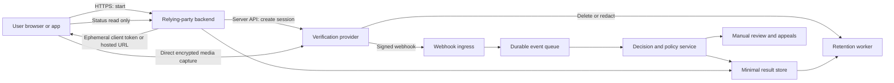

# A-to-Z Blueprint for a World-Class Identity Verification System

**Phase:** 1 — independent research and reusable engineering blueprint  
**Research cut-off:** 25 July 2026  
**Audience:** product, engineering, security, privacy, fraud operations and executive teams  
**Scope boundary:** This document does **not** design or change MenRush. It establishes the evidence base that Phase 2 can apply.

> This is a technical and product blueprint, not legal advice. Biometric and age-assurance deployments need jurisdiction-specific advice, a documented DPIA, and current provider contract review before launch.

## Executive position

A production identity-verification system is not a camera page followed by a face comparison. It is an asynchronous, adversarial decision system with five separable questions:

1. **Was usable evidence captured?**
2. **Is the document authentic and internally consistent?**
3. **Is a live person genuinely present at the capture device?**
4. **Does that person match the document portrait?**
5. **Does the wider session look fraudulent, duplicated, coerced or automated?**

The safest implementation is normally a hybrid: the product owns purpose selection, consent, branded pre- and post-flow UX, account binding, orchestration, policy, appeals and minimal result storage; a specialist provider owns high-risk media capture, document models, liveness/PAD, face matching and continuously updated fraud intelligence. The provider's browser callback is never the source of truth. A signed server-to-server webhook, followed when necessary by an authenticated API retrieval, is.

No single passive cue—including texture, depth estimated from RGB, blink, or rPPG—is proof of life. The defensible design uses multi-frame, multi-region and multi-signal fusion; detects digital injection separately from physical presentation attacks; applies device, network and velocity risk; and routes uncertain outcomes to retries or human review instead of forcing every score into pass/fail.

---

## 1. Assurance model: define the claim before choosing the technology

Identity verification is often used as an imprecise umbrella term. A system must name the exact claim it is proving.

| Claim | Evidence | What it does **not** prove |
|---|---|---|
| Document possessed | Images/NFC data from an acceptable document | Current holder, liveness or good intent |
| Document authentic | Template, security-feature, data-consistency and issuing-source checks | That the submitter owns it |
| Live person present | PAD/liveness signals bound to a session challenge | Legal identity or age by itself |
| Face match | Similarity between live capture and trusted portrait | Liveness unless PAD is separately passed |
| Age threshold | Verified DOB, age-estimation, digital credential or other approved age method | Legal name unless requested and justified |
| Returning verified user | Fresh authentication bound to a prior identity | Continued good behaviour or account safety |

Treat these as separate policy outputs. Do not expose an ambiguous `verified: true` when downstream code needs to know which claim passed, when, by which method, at what assurance level, and whether it is still valid.

## 2. Reference architecture

### 2.1 Trust boundaries



The boundaries are important:

- The browser is untrusted. It may be automated, modified or connected to a virtual camera.
- The product backend is authoritative for account binding and entitlements.
- Provider-hosted capture should receive raw media directly when possible, so the product never becomes a second biometric store.
- Webhooks are hostile internet input until their signature, timestamp and event identity are verified.
- Review tooling is a privileged system holding unusually sensitive data; it requires strict role separation and access auditing.

### 2.2 Recommended ownership split

**Product-owned**

- choose and disclose the purpose;
- authenticate the user before session creation;
- assign an opaque internal subject reference;
- decide which checks are necessary;
- show consent and alternatives;
- create provider sessions server-side;
- bind exactly one active attempt to the user and purpose;
- process verified webhook outcomes idempotently;
- translate provider results into stable internal reason codes;
- operate appeals, abuse controls, retention and deletion evidence;
- store only necessary outcome facts.

**Provider-owned**

- browser/native capture SDK and camera compatibility;
- document detection, crop, quality, classification, OCR and authenticity models;
- liveness/PAD and injection detection;
- face-template generation and comparison;
- document-template and fraud-network updates;
- optional manual evidence review;
- raw-media protection and contractually defined deletion.

Building capture and biometric inference in-house is justified only with a sustained biometrics team, representative datasets, accredited testing, attack-lab capability, model monitoring and jurisdictional compliance. A convincing demo is not evidence of PAD resilience.

### 2.3 Session creation pattern

The backend creates the session after authenticating the user. It sends:

- an opaque, non-PII subject reference;
- the requested verification policy/version;
- locale and accessibility preferences where supported;
- callback URL, webhook configuration and expiry;
- the minimum necessary prefilled data;
- an idempotency key tied to user + purpose + attempt generation.

It returns only the provider's short-lived client token or hosted-session URL. Provider API secrets never reach the client. Stripe explicitly warns that its client secret must not be logged, placed in a URL or exposed to anyone other than the subject; Veriff and other providers similarly create a unique session URL from a server-created session ([Stripe Verification Sessions](https://docs.stripe.com/identity/verification-sessions), [Veriff create session](https://devdocs.veriff.com/apidocs/v1sessions)).

### 2.4 Internal state machine

Provider states differ, so translate them into a durable internal model rather than letting provider vocabulary leak through the application:

```text
created
  -> ready
  -> in_progress
  -> submitted
  -> processing
  -> passed
  -> retry_required
  -> review_required
  -> failed
  -> expired
  -> cancelled
  -> redaction_pending
  -> redacted
```

Rules:

- transitions are monotonic except a documented provider re-review/reversal event;
- each event is recorded with provider event ID, provider timestamp and received timestamp;
- duplicates are safe;
- out-of-order events are safe;
- a client `complete` callback can advance UI to `submitted`, never to `passed`;
- a pass is granted only from a verified server event or authenticated server retrieval;
- a later fraud reversal removes the assurance-derived privilege and opens an audit event;
- raw provider payloads are not copied indefinitely merely for debugging.

Persona says webhooks are the only reliable source for inquiry status; SDK callbacks are not authoritative. Sumsub warns that an applicant may receive more than one final webhook and an approval may later become red. Stripe recommends webhooks because some checks finish asynchronously ([Persona status guidance](https://docs.withpersona.com/accessing-inquiry-status), [Sumsub results](https://docs.sumsub.com/docs/receive-verification-results), [Stripe document flow](https://docs.stripe.com/identity/verify-identity-documents?locale=en-GB&platform=web&type=redirect)).

### 2.5 Webhook ingestion

The ingress handler should do very little:

1. Read the exact raw body.
2. Verify HMAC/signature with constant-time comparison.
3. Enforce a timestamp tolerance where the provider supports it.
4. Reject oversized bodies and unsupported content types.
5. Insert `(provider, event_id)` under a unique constraint.
6. Enqueue the event and return success quickly.
7. A worker retrieves the current provider object if the webhook lacks enough trusted detail.
8. Apply a transactionally locked state transition and emit an internal domain event.

Never trust a session ID supplied by the browser to grant another user's account. Resolve the session through the backend's stored subject binding. Rotate webhook secrets, allow controlled overlap during rotation, monitor signature failures, and retain only non-sensitive audit facts.

## 3. What leading platforms reveal

Vendor internals are proprietary. The table records publicly documented integration behavior and vendor-published capability claims, not an independent endorsement.

| Platform | Public integration model | Notable documented behavior | Evidence boundary |
|---|---|---|---|
| Veriff | Hosted/web/native SDK or media API; session URL; signed decision webhook; polling fallback | Session lifecycle, resubmission, device/risk labels, CrossLinks, customizable launch flow, direct API capture option | Detailed PAD and risk models are proprietary; marketing claims must be validated in a POC and independent certificates |
| Persona | Hosted/embedded inquiry; templates and modular verifications; workflows/cases; webhooks | Pre-created inquiries recommended in production; `approved`, `needs_review`, `declined`; sandbox event simulation; account/inquiry redaction | Public release notes name ensemble liveness/injection improvements but not model internals |
| Entrust/Onfido | Smart Capture SDK + Workflow Studio/API; cross-device capture | QR/SMS handoff, live document capture, face photo/video/motion, upload fallbacks | Public web SDK material is partly legacy; confirm current Entrust contract and SDK version |
| Jumio | Workflow transaction with credentials, capabilities and risk signals | Document/selfie/facemap, detailed rejection labels, configurable weighted risk score and velocity rules | Exact default scoring and liveness internals remain proprietary |
| Yoti | Server-created session + embedded client; checks/tasks; notifications/results | Authenticity, OCR, static/active liveness, face match, manual fallbacks, resource TTLs, supported-document API | Vendor explains many document checks; algorithm performance still needs independent evidence |
| Sumsub | Applicant + level/workflow + web/mobile SDK; reviewed webhooks | Liveness/face match, device intelligence, fraud networks, case routing and repeat final decisions | Deepfake/3D claims are vendor claims; evaluate exact licensed modules |
| Stripe Identity | VerificationSession + Stripe.js/hosted flow + webhooks | Small API surface, document+selfie, explicit redaction, restricted keys and 30-second image links | Less orchestration flexibility than specialist suites; product-specific country/check coverage must be confirmed |
| iProov | Specialist liveness SDK/OIDC; backend token and server result verification | Dynamic and Express Liveness, fresh verification, data-minimal OIDC claims | Primarily a biometric-presence component, not a complete document/KYC platform |
| Incode | Web/native SDK or modular APIs; sessions and webhooks | Separate face-liveness and face-match calls, document modules, status retrieval | Confirm product package, regions and independent evaluation in procurement |

Representative primary documentation: [Veriff SDK lifecycle](https://devdocs.veriff.com/docs/quick-guide-of-idv-using-the-sdks-1), [Persona model](https://docs.withpersona.com/2023-01-05/how-persona-works), [Jumio workflow reference](https://documentation.jumio.ai/docs/developer-resources/API/References/service-and-workflow-reference), [Yoti introduction](https://developers.yoti.com/identity-verification/introduction), [Sumsub liveness](https://docs.sumsub.com/docs/liveness), [Stripe checks](https://docs.stripe.com/identity/verification-checks?locale=en-GB&type=selfie), [iProov Web SDK](https://github.com/iProov/web), [Incode Web SDK](https://developer.incode.com/docs/incode-web-sdk-2-reference).

### 3.1 Provider architecture notes

**Veriff.** A server creates a session and stores its UUID. The response contains a unique verification URL for redirect or in-context/native SDK use. Media can alternatively be collected by the relying party and uploaded through the API, but that makes the relying party responsible for more sensitive capture and transfer. Public session states include `created` and `started`, with final decisions such as approved, declined and resubmission requested delivered primarily by decision webhook and available by polling as backup. Veriff documents HMAC-signed webhook headers and risk-label families covering client-data mismatch, crosslinks, device, document, images, network, session and person. Its SDKs collect richer video/device evidence than a bare media API. The public material says its liveness is multi-layered and addresses prerecorded/synthetic/injected media, but does not disclose enough algorithm detail to attribute a specific signal such as rPPG ([Veriff webhooks](https://devdocs.veriff.com/docs/webhooks-guide), [Veriff decision webhook](https://devdocs.veriff.com/docs/decision-webhook), [Veriff biometric liveness](https://devdocs.veriff.com/docs/biometric-liveness)).

**Persona.** An inquiry template defines UI, data collection and modular verifications; an inquiry is one execution, an account can link multiple inquiries to the same internal subject, and a case supports manual review. For production embedded use, Persona recommends pre-creating the inquiry by API rather than allowing every page load to create one. Collection states such as `created`, `pending`, `completed`, `failed` and `expired` are distinct from post-processing decisions `approved`, `needs_review` and `declined`. Its public Selfie Verification reference describes image quality, face comparison and face liveness, with release notes for ensemble models and injection/deepfake improvements; it does not disclose the constituent PAD features. Inquiry/account/verification redaction is available and asynchronous child-object redaction is explicitly documented ([Persona embedded flow](https://docs.withpersona.com/embedded-flow), [Persona selfie verification](https://docs.withpersona.com/api-reference/verifications/selfie-verifications), [Persona lifecycle](https://docs.withpersona.com/model-lifecycle)).

**Entrust/Onfido.** The public Smart Capture pattern uses an SDK token or Workflow Studio run, captures document and face media, then lets the backend initiate or consume the authoritative check/workflow result. The documented web experience includes desktop-to-phone QR/SMS handoff, optimized live capture and photo/video/motion face capture. The SDK warns that an HTML file-input fallback may allow gallery selection and therefore does not guarantee live capture. That is a useful general design lesson: fallback method is an assurance input, not merely UX metadata. Some easily discoverable Onfido web documentation is an older version, so every implementation assumption must be reconfirmed against the current Entrust contract and SDK.

**Jumio.** A workflow transaction consumes credentials—ID, document, selfie, facemap or prepared device data—and executes capabilities such as usability, extraction, image checks, liveness and similarity plus optional risk signals. Each capability returns a decision; the workflow produces an overall decision and risk score. Public documentation describes scores from 0–100, default pass/warning/reject bands, weighted capability aggregation and rule adjustments. Facemap consists of multiple rapid images created by the client/SDK and cannot be uploaded through the ordinary API; Jumio says it improves liveness evaluation. Its detailed rejection labels are operationally valuable because they distinguish poor capture from manipulation, screen/photocopy and person-switch events ([Jumio liveness](https://documentation.jumio.ai/docs/references/capabilities/liveness), [Jumio facemap](https://docs.jumio.com/production/Content/References/Credentials/Facemap.htm), [Jumio result handling](https://documentation.jumio.ai/docs/developer-resources/businessLogicGuide)).

**Yoti.** The relying-party backend creates a session specification with checks, tasks, client-token/resource TTLs, SDK configuration and notification topics. Checks may include document authenticity, static or zoom liveness and document-face match; tasks include text extraction; configured manual fallback can rescue authenticity, extraction or face match but not every liveness mode. The browser loads Yoti's client with a session ID/token and the backend retrieves the completed session/resources. Its documentation exposes a supported-document endpoint instead of requiring a hard-coded list and recommends notifications for session state. Yoti's active zoom liveness uses a short sequence, while static passive liveness uses several images and a face-shaped guide ([Yoti create session](https://developers.yoti.com/identity-verification/create-a-session), [Yoti liveness report](https://developers.yoti.com/identity-verification/liveness-report), [Yoti supported documents](https://developers.yoti.com/identity-verification/supported-documents)).

**Sumsub.** An applicant is evaluated under a configured verification level through a WebSDK/MobileSDK or API. The platform can combine documents, advanced liveness/face match, IP and device intelligence, fraud networks, workflow rules and case management. `applicantReviewed` is the principal result event. Sumsub explicitly notes that later review can issue another final result, including a later rejection, so immutable “first final wins” code is unsafe. Public liveness material makes claims about 3D maps and detection of screens, masks, deepfakes and injection; the specific licensed module and independent test scope must be verified rather than inferred from the general product page.

**Stripe Identity.** A server creates a `VerificationSession` for a document or other supported check and returns a short-lived client secret or hosted URL. States include created, processing, verified, requires input, canceled and redacted. A matching-selfie option links the selfie to the document portrait. Stripe exposes reason codes, webhooks and a compact API rather than a broad workflow/case platform. Restricted keys are required for sensitive expanded results; document/selfie FileLinks must expire within 30 seconds. Redaction is first-class and can take up to four days. This is a strong reference for minimizing product access to raw media, even when another provider is selected ([Stripe outcomes](https://docs.stripe.com/identity/handle-verification-outcomes?locale=en-GB), [Stripe sensitive results](https://docs.stripe.com/identity/access-verification-results?locale=en-GB)).

**iProov.** iProov is best understood as a specialized genuine-presence/liveness component rather than a full document-verification platform. The official web integration requires a transaction token generated by the customer backend and says the backend must validate the result. Its OIDC option can return assurance claims bound to a particular authorization request and no personal profile for liveness-only use. “Dynamic” and “Express” Liveness are vendor product categories; the detailed signal implementation remains proprietary. It can therefore complement a document provider but should not be represented as performing document authenticity when it does not.

**Incode.** Incode exposes a web/native SDK and modular onboarding APIs for document capture/OCR/authenticity, face capture/liveness, face match and risk/workflow components. Its API material makes liveness and face comparison separate ordered operations, an important reminder not to conflate a genuine face with the correct identity. Status webhooks are preferred and status retrieval is a fallback. As with every modular API, a fully custom capture path gives more brand control but moves capture security, media handling and accessibility obligations toward the relying party ([Incode status](https://developer.incode.com/docs/retrieve-understand-status), [Incode face validation](https://developer.incode.com/docs/api-onboarding-face-validation), [Incode webhooks](https://developer.incode.com/docs/webhooks)).

### 3.2 Procurement evidence to demand

Do not select a provider from a pass-rate slide. Require:

- full document coverage by country, document type, version and capture channel;
- independent PAD certificate and scope, including attack species, level, test date and product version;
- face-match FAR/FRR by relevant demographic and image-quality cohorts;
- injection/deepfake threat coverage, including virtual cameras and emulator/root signals;
- false-reject and retry behavior on representative low-end devices;
- accessibility conformance and assisted/manual alternatives;
- data-region, subprocessor, training-use and cross-border terms;
- deletion API, deletion SLA and deletion completion evidence;
- incident-notification terms and penetration-test/SOC/ISO evidence;
- webhook signing, replay protection, audit export and API versioning policy;
- sandbox fidelity and production test modes;
- cost definition: created, started, submitted, completed, retry and manual-review charges;
- rate limits and operational support SLAs;
- a red-team POC using your own attack matrix.

## 4. Document verification pipeline

### 4.1 Capture channels

Use a risk-ranked capture policy:

1. **NFC chip read** where supported: strongest source of signed data and high-quality chip portrait, though device/document coverage and UX vary.
2. **Provider-controlled live camera capture:** preferred optical method; prevents a simple file chooser from silently becoming the normal path.
3. **Cross-device mobile handoff:** desktop session produces a single-use QR/link; the phone completes capture; desktop learns completion from the backend, not local browser messaging alone.
4. **File upload fallback:** necessary for accessibility and hardware failure, but distinctly higher risk and subject to stronger manipulation/injection checks or review.

Cross-device tokens must be random, single-purpose, short-lived, bound to the original server session, invalid after first successful claim, and safe if a QR is photographed. Do not encode account PII or a bearer token that can call unrelated APIs. Onfido documents QR/SMS handoff and notes that disabling upload fallback raises live-capture assurance but can block unsupported devices ([Onfido Web SDK](https://documentation.onfido.com/sdk/web/8.0.0/)).

### 4.2 Capture quality gates

Quality checks should run before an expensive provider submission when they can be performed safely on device:

- document quadrilateral and corner coverage;
- minimum effective resolution after crop;
- focus/blur, motion smear and compression damage;
- under/over-exposure and glare distribution;
- occlusion, fingers over data, cropped edges;
- scale and perspective/skew;
- correct side and orientation;
- one document only;
- document-to-background contrast;
- expected barcode/MRZ region present where applicable.

Quality failure is not fraud. Tell the user exactly how to fix it and preserve privacy-respecting retry limits.

### 4.3 Multi-side handling

The document policy, not the UI, determines required sides. Some cards put machine-readable data or security features on the back. Each side gets a distinct upload slot and checksum. The server records side completeness but should not infer authenticity from file names or client metadata. A front/back country, document number or identity mismatch is a fraud signal.

### 4.4 Classification and extraction

Typical stages are:

1. classify issuing country, document class and version;
2. detect/correct orientation and perspective;
3. segment portrait, text, MRZ and barcode zones;
4. OCR visible data;
5. parse MRZ and PDF417/other barcode data;
6. validate MRZ checksums and field formats;
7. compare repeated data across visible, MRZ, barcode and chip sources;
8. validate issue/expiry dates, age and logical consistency;
9. compare against template and known specimen geometry;
10. return extracted facts with field confidence and reason codes.

OCR success is not authenticity. A generated document can contain perfectly consistent text.

### 4.5 Authenticity checks

Optical authenticity combines multiple weak-to-strong signals:

- layout, font, kerning, emblem and background-pattern consistency;
- microprint and print-process artifacts;
- portrait substitution, seam and recompression traces;
- data-zone alignment and altered text regions;
- MRZ/barcode/visible-data cross-consistency;
- hologram or optically variable feature behavior across frames/angles;
- specular response and laminate boundaries;
- screen/photocopy/print detection;
- known specimen, fake and compromised-document databases;
- issuing database validation where lawful and available;
- NFC chip signature and data-group consistency where supported.

Yoti publicly describes hologram movement, printing, font, security-feature, document-number, screen/physical-document and portrait-integrity checks. Jumio exposes detailed outcomes such as digital manipulation, missing chip, front/back mismatch, altered portrait/text and specimen/fake detection ([Yoti authenticity](https://developers.yoti.com/identity-verification/document-authenticity?redirect_from=%2Fidentity-verification%2Fdocument-report), [Jumio image checks](https://documentation.jumio.ai/docs/references/capabilities/image-checks)).

### 4.6 International documents

Maintain a versioned coverage policy keyed by country, document class, version, capture method and assurance outcome. The UI must query current coverage rather than hard-code a country list. Support non-Latin scripts, transliteration, compound names, uncertain dates, right-to-left UX and documents without the fields assumed by UK/US schemas. Store ISO country codes and original provider field representations; never force a legal identity into a simplistic first/last-name model merely for display.

## 5. Automatic capture: the quality-critical subsystem

Automatic capture is not a timer attached to a camera overlay. It is a real-time decision controller that must answer four questions independently:

1. Is the intended subject present and correctly framed?
2. Is the current frame technically usable?
3. Has that quality remained stable for long enough to avoid a lucky or transient frame?
4. Is capture permitted by the product state, accessibility mode and attempt policy?

The best public evidence supports multi-frame capture rather than a single photograph. Yoti documents capturing several photos in rapid sequence so blur or glare in one frame does not necessarily force a retry. Persona distinguishes automatic, manual, upload and mixed capture methods in analytics. Entrust/Onfido documents real-time blur/glare validation and automatic passport capture in its full mobile SDK, while its lighter core SDK lacks the same on-device checks. These are vendor-described behaviours, not proof that one vendor is universally more accurate ([Yoti IDV overview](https://developers.yoti.com/identity-verification), [Persona capture analytics](https://help.withpersona.com/articles/3c2XDYIxmf9PjivgeJtx3i/), [Entrust Android SDK](https://documentation.onfido.com/sdk/android/20.4.0/)).

### 5.1 What separates excellent capture from average capture

| Average implementation | Best-in-class implementation |
|---|---|
| Fixed rectangular overlay | Detected document/face geometry drives the overlay |
| Whole-frame blur threshold | Quality is measured inside rectified regions of interest |
| One global threshold | Thresholds are calibrated by device, resolution and capture mode |
| Capture after a countdown | Capture after consecutive stable, high-quality frames |
| One opaque “quality” number | Hard safety gates plus explainable component scores |
| Every detector speaks at once | A guidance arbiter shows one highest-value correction |
| Captured preview equals camera crop | Full-resolution source is cropped using mapped detector coordinates |
| Retry forever | Attempt budget, assisted fallback and resumable cross-device handoff |
| “Failed” for any poor frame | Quality failure, unsupported device and suspected fraud remain separate |
| Optimised on flagship phones | Representative testing includes low-end Android, older iOS, desktop webcams and adverse lighting |

High-conversion capture is fast but not impatient. The controller should become responsive within roughly 300–500 ms after the camera settles, analyse at a device-sustainable rate, and capture only after a short stable window. Exact latency and quality thresholds must be measured on the supported device matrix; they are not safe universal constants.

### 5.2 Real-time pipeline

```text
camera frame
  -> orientation/mirroring normalization
  -> low-resolution analysis copy
  -> document or face detector
  -> region-of-interest rectification
  -> component quality scores
  -> hard-gate evaluation
  -> temporal smoothing and consensus
  -> guidance arbitration
  -> best-frame selection
  -> full-resolution crop from the original frame
  -> local confirmation or provider-direct upload
```

Run lightweight analysis in a Web Worker or provider SDK, not on React's render path. `requestVideoFrameCallback` is preferable when available because it schedules work against presented video frames; throttle analysis independently from display refresh. Request camera constraints as preferences, inspect the actual track settings, and degrade gracefully because browser constraints are best-effort. The W3C specification explicitly warns that supported capabilities and combined settings differ by device ([Media Capture and Streams](https://www.w3.org/TR/mediacapture-streams/), [requestVideoFrameCallback](https://developer.mozilla.org/en-US/docs/Web/API/HTMLVideoElement/requestVideoFrameCallback)).

### 5.3 Document capture gates

Use these hard gates before any aggregate score:

- exactly one plausible document quadrilateral;
- all four corners inside a safe margin;
- document area within a calibrated range, not merely “large enough”;
- perspective and aspect ratio compatible with the selected document class;
- no critical field region is clipped or covered;
- minimum effective pixels after perspective correction;
- no large saturated/glare region over portrait, MRZ, barcode or primary text;
- motion below the capture threshold;
- supported orientation and side.

Then rank otherwise valid frames by combined quality. Do not “repair” an unreadable ID with generative enhancement. Perspective normalization and conservative denoising are acceptable for analysis, but the original evidence must remain available to the provider during its short retention window.

### 5.4 Selfie and liveness capture gates

Require:

- exactly one face;
- face bounding box within a target size band;
- eye midpoint close to the target centre;
- yaw, pitch and roll within mode-specific bounds;
- both eyes and key face regions visible;
- adequate, reasonably uniform facial illumination without clipping;
- low motion for a still selfie, or the expected motion for an active challenge;
- no prohibited occlusion for the check being performed;
- live camera provenance/injection checks handled separately from visual quality.

The overlay should be a portrait-shaped oval, not a circle. Its geometry is guidance only; measured landmarks and pose determine readiness. Face size should be calculated against the shorter frame dimension so portrait and landscape behaviour remain consistent.

### 5.5 Guidance arbitration

Show one instruction at a time, selected by expected improvement:

```text
no subject -> centre document / face
clipped geometry -> move farther away
subject too small -> move closer
high perspective -> hold phone parallel
motion -> hold steady
glare -> tilt slightly or move away from direct light
underexposure -> face a light / move somewhere brighter
otherwise -> hold still, capturing
```

Use hysteresis so advice does not flicker at a boundary. Announce changes through a polite `aria-live` region no more often than necessary. Never use red “fraud” language for capture quality.

## 6. Real-time image-quality scoring algorithms

The following algorithms are suitable as an on-device preflight layer. They improve capture usability; they do not replace provider document authenticity, PAD or face-match models.

### 6.1 Sharpness: local variance of Laplacian

For grayscale region \(I\), compute \(L = \nabla^2(G_\sigma * I)\), then:

\[
S_{sharp} = \operatorname{Var}(L)
\]

Downscale the rectified region to a bounded analysis size, apply light Gaussian denoising, and calculate the score over text/portrait regions rather than a background-heavy full frame. Laplacian response depends on resolution, noise, contrast and content, so `100` is not a universal pass threshold. Calibrate normalized score distributions per capture mode and actual camera settings. OpenCV documents the Laplacian as a second-derivative edge operator; document-IQA research shows that text-region gradients correlate better with OCR utility than whole-image natural-scene scores ([OpenCV Laplacian](https://docs.opencv.org/master/d5/d0f/tutorial_py_gradients.html), [CG-DIQA](https://arxiv.org/abs/1807.04047)).

```ts
export function variance(values: Float32Array): number {
  let mean = 0;
  for (const value of values) mean += value;
  mean /= Math.max(values.length, 1);
  let sum = 0;
  for (const value of values) sum += (value - mean) ** 2;
  return sum / Math.max(values.length, 1);
}

export function normalizeHigherBetter(
  value: number,
  failAt: number,
  passAt: number,
): number {
  return Math.max(0, Math.min(100, 100 * (value - failAt) / (passAt - failAt)));
}
```

In production, obtain the Laplacian samples with OpenCV.js/WASM or an equivalent tested kernel. Keep negative derivatives in a signed or floating-point buffer; converting immediately to unsigned bytes destroys half the response.

### 6.2 Glare and reflection

A useful fast detector creates a glare heat map inside the rectified document:

1. convert pixels to HSV or linear-light luminance/chroma;
2. mark pixels with very high luminance and low saturation;
3. reject isolated sensor noise with morphology;
4. form connected components;
5. measure total glare ratio, largest component, edge softness and overlap with critical regions;
6. compare the mask across recent frames—moving specular regions can be distinguished from printed white areas.

Do not reject merely because a passport page contains white background. A fast-glare research approach divides document images into blocks and combines luminance with black/white stroke evidence, reflecting why saturation alone is insufficient ([Fast Glare Detection in Document Images](https://arxiv.org/abs/1911.05189)). A severe critical-region overlap is a hard gate; small peripheral highlights reduce the aggregate score.

### 6.3 Motion blur and stability

Use two complementary measures:

- **Frame difference:** after aligning the detected subject, calculate median absolute luminance difference. This is cheap but confuses exposure changes with movement.
- **Optical flow:** track reliable corner/features between frames and use median flow magnitude plus robust dispersion. Subtract the document homography or estimated global face motion before measuring residual instability.

OpenCV's pyramidal Lucas–Kanade implementation exposes status/error values and recommends periodically redetecting points and using a forward/backward consistency check for robustness ([OpenCV optical flow](https://docs.opencv.org/master/d4/dee/tutorial_optical_flow.html)).

For a document, stable corner coordinates and low residual flow are required. For active liveness, expected head movement must not be treated as generic failure; the controller evaluates challenge motion and camera shake separately.

### 6.4 Document corner confidence and perspective

The preferred detector returns four ordered corners plus confidence. A classical fallback:

1. downscale and normalize luminance;
2. detect edges;
3. close small gaps morphologically;
4. find contours;
5. approximate convex polygons;
6. score four-corner candidates by detector confidence, area, convexity, edge support, angle plausibility, aspect-ratio plausibility and temporal stability.

```ts
export type Point = { x: number; y: number };
export type Quad = readonly [Point, Point, Point, Point];

export function quadCoverage(q: Quad, frameArea: number): number {
  let twiceArea = 0;
  for (let i = 0; i < 4; i += 1) {
    const a = q[i];
    const b = q[(i + 1) % 4];
    twiceArea += a.x * b.y - b.x * a.y;
  }
  return Math.abs(twiceArea) / 2 / frameArea;
}

export function cornerStability(previous: Quad, current: Quad, diagonal: number): number {
  const meanMovement = current.reduce((sum, p, index) => {
    const q = previous[index];
    return sum + Math.hypot(p.x - q.x, p.y - q.y);
  }, 0) / 4;
  return Math.max(0, 100 * (1 - meanMovement / (0.03 * diagonal)));
}
```

Map the accepted corners back to the source frame and use a four-point perspective transform for analysis/cropping. OpenCV defines the transform from four corresponding point pairs ([OpenCV geometric transforms](https://docs.opencv.org/master/da/d54/group__imgproc__transform.html)).

### 6.5 Lighting and exposure uniformity

Inside the subject mask:

- compute luminance percentiles rather than only a mean;
- calculate clipped-dark and clipped-bright pixel ratios;
- divide the region into tiles and compute the coefficient of variation of tile means;
- fit a low-order illumination plane and measure residual non-uniformity;
- for faces, compare left/right cheek and forehead regions while avoiding demographic assumptions about absolute skin brightness.

Quality is about usable signal and local clipping, not making every face equally bright. Exposure thresholds must be evaluated by skin-tone cohort, camera and environment.

### 6.6 Face size, position and pose

Let `f` be detected face area / frame area, and `d` be normalized distance from eye midpoint to target:

\[
S_{size}=100(1-\min(1, |f-f_t|/r_f)),\qquad
S_{position}=100(1-\min(1,d/r_d))
\]

Combine these with pose, occlusion, sharpness and lighting. A face can be perfectly centred and still unusable. NIST's face-image quality work treats pose, illumination, motion blur, face position and related properties as distinct quality components, supporting vector quality rather than a single aesthetic score ([NISTIR 8485](https://nvlpubs.nist.gov/nistpubs/ir/2023/NIST.IR.8485.pdf)).

### 6.7 Combined score: hard gates plus conservative fusion

Do not allow a high lighting score to compensate for a clipped document. First apply hard gates. For valid frames, use a weighted geometric mean or soft minimum:

\[
Q = 100 \prod_i (\max(\epsilon, s_i/100))^{w_i},\quad \sum_i w_i=1
\]

```ts
export type QualityVector = {
  geometry: number;
  sharpness: number;
  glare: number;
  stability: number;
  lighting: number;
};

const weights: Record<keyof QualityVector, number> = {
  geometry: 0.30,
  sharpness: 0.25,
  glare: 0.20,
  stability: 0.15,
  lighting: 0.10,
};

export function combinedQuality(q: QualityVector): number {
  return 100 * Object.entries(weights).reduce(
    (product, [key, weight]) =>
      product * Math.max(0.01, q[key as keyof QualityVector] / 100) ** weight,
    1,
  );
}
```

Return the full vector with the score. Operations need to know *why* capture is failing.

## 7. Temporal consensus, calibration and fallback

### 7.1 Multi-frame consensus controller

Require several recent frames to pass hard gates and the quality threshold. Keep the best full-resolution candidate from that window, not necessarily the final frame.

```ts
type Assessment = {
  at: number;
  hardPass: boolean;
  quality: number;
  guidance: string | null;
};

export class CaptureConsensus {
  private window: Assessment[] = [];

  constructor(
    private readonly windowSize = 7,
    private readonly requiredPasses = 5,
    private readonly threshold = 78,
  ) {}

  push(next: Assessment): { ready: boolean; best?: Assessment } {
    this.window.push(next);
    this.window = this.window.slice(-this.windowSize);
    const passing = this.window.filter(
      frame => frame.hardPass && frame.quality >= this.threshold,
    );
    const ready = passing.length >= this.requiredPasses
      && this.window.slice(-3).every(frame => frame.hardPass);
    const best = passing.reduce<Assessment | undefined>(
      (winner, frame) => !winner || frame.quality > winner.quality ? frame : winner,
      undefined,
    );
    return { ready, best: ready ? best : undefined };
  }
}
```

Add a short capture lock so the UI cannot double-submit. Reset consensus when the detected document changes, the required side changes, the tab loses visibility or camera settings change.

### 7.2 Adaptive thresholds

Adaptation must improve usability without silently weakening security:

- normalize sharpness against actual resolution and a short warm-up distribution;
- maintain separate calibrated profiles for document, selfie and active-video modes;
- use device class only as a feature, never as permission to accept unreadable evidence;
- adapt analysis rate before lowering quality;
- preserve immutable minima for corner coverage, clipping and critical glare;
- version every threshold set and log only non-sensitive score/reason aggregates;
- recalibrate from labelled genuine and attack data, not successful users alone.

Start with conservative offline thresholds, then use controlled shadow scoring. Compare false retry rate, downstream provider retry rate and fraud catch rate. Promotion needs a documented experiment and rollback.

### 7.3 Failure modes and assisted fallback

After repeated failures:

1. explain the specific persistent issue;
2. offer a short illustrated tip;
3. allow manual shutter while retaining non-negotiable quality gates;
4. offer phone handoff from desktop;
5. offer supported file upload only under a higher-risk policy;
6. offer another document or non-biometric/manual route where the assurance purpose permits.

Do not trap users with tremor, motor impairment, facial difference, head covering, low vision or unsupported hardware. Manual capture means the user controls timing; it does not mean the backend trusts the pixels.

### 7.4 Performance and success metrics

There is no credible universal “best provider success rate”: document mix, country, attack pressure, required checks and retry policy change the denominator. Vendor case studies may demonstrate improvement—for example, Persona publishes a customer claim of doubled conversion after switching provider—but they are not transferable benchmarks ([Persona customer case study](https://withpersona.com/customers/international-crypto-exchange/)).

Measure the funnel by device, browser, document and demographic cohort:

- permission-to-preview latency;
- time to first actionable guidance;
- time to auto-capture;
- auto-capture share versus manual/fallback;
- first-attempt technical acceptance;
- average captures per side;
- provider quality retry rate;
- user abandonment at each capture state;
- false retry rate on genuine users;
- unreadable-field/OCR failure after client acceptance;
- downstream PAD/face-match uncertainty;
- p50/p95 analysis time and dropped-frame rate;
- thermal/battery impact on representative low-end devices.

An appropriate POC target is defined relative to a labelled baseline: materially reduce provider quality retries and median user effort without increasing attack acceptance or cohort disparity. Publish the exact denominator whenever reporting “completion” or “pass rate.”

## 8. Liveness and presentation attack detection

### 8.1 Threat taxonomy

Distinguish:

- **Presentation attacks at the camera:** printed photo, cut-out photo, replayed display, 2D/3D mask, mannequin, partial artifacts, makeup/disguise.
- **Digital injection:** virtual camera, API hooking, emulator, rooted device, prerecorded/synthetic frame injection, patched SDK, browser devtools automation.
- **Identity attacks:** stolen or synthetic document, lookalike, face morph, coercion, paid verifier, account farming.

ISO/IEC 30107-3 defines PAD testing/reporting and attack classification at the capture device; it does not prescribe an algorithm and does not cover the whole system ([ISO/IEC 30107-3:2023](https://www.iso.org/standard/79520.html)). Digital injection therefore needs its own control family.

### 8.2 Active liveness

The system asks for an unpredictable action: blink, smile, turn, move closer, follow a dot, read digits or respond to controlled illumination.

**Strengths**

- binds temporal behavior to a short-lived server challenge;
- raises the cost of simple photo and replay attacks;
- can measure challenge timing, head pose, optical flow and response consistency.

**Weaknesses**

- creates accessibility, language and cognitive burden;
- predictable challenge libraries can be generated or replayed;
- deepfake pipelines can respond interactively;
- long or theatrical sequences increase abandonment;
- blink/smile alone are not meaningful PAD in 2026.

Use cryptographically random, expiring challenges only when risk warrants the friction. Never make a particular facial expression the sole path; offer an equivalent alternative.

### 8.3 Passive liveness

Passive PAD records a short selfie/photo/video while the user simply aligns their face. It may evaluate texture, reflection, depth, motion, temporal consistency, rPPG, capture integrity and device signals.

**Strengths:** low friction, language-neutral, usually fast.  
**Weaknesses:** opaque, data- and domain-dependent, vulnerable to unseen attack types and injection if capture integrity is weak.

NIST's passive software PAD evaluation found performance varied widely by algorithm, use case and presentation-attack type; only a small proportion showed notable detection across the evaluated attacks. Certification or a good average score is not universal immunity ([NISTIR 8491](https://www.nist.gov/publications/face-analysis-technology-evaluation-fate-part-10-performance-passive-software-based)).

### 8.4 Signal families

**Motion and temporal consistency**

- facial landmark trajectories and non-rigid motion;
- head-pose/optical-flow consistency;
- motion parallax between face and background;
- frame timing, duplication, discontinuity and codec artifacts;
- challenge-response latency and causal response to randomized prompts.

**Texture and frequency**

- local binary patterns, gradients and learned micro-texture;
- printer halftone, screen subpixel and resampling artifacts;
- moiré peaks, periodic lattice energy and replay-display scan behavior;
- over-smoothing, generative texture and boundary inconsistencies.

**Geometry and depth**

- monocular depth prediction and face convexity;
- stereo/structured-light/ToF where hardware permits;
- consistency between pose change and estimated 3D structure.

**Reflectance/material**

- skin vs paper, glass/display or silicone response;
- diffuse/specular reflection distribution;
- randomized screen/flash illumination response;
- iris highlights and spatial reflection coherence.

**Physiological**

- rPPG spatial/temporal coherence;
- pulse plausibility and phase across skin regions;
- agreement with motion/respiration rather than a single heart-rate number.

Research supports treating spoof detection as a material-recognition and temporal-fusion problem, not a single classifier. Work combines texture, depth and reflection, while controlled flash methods exploit specular and diffuse response ([Human Material Perception PAD](https://www.ecva.net/papers/eccv_2020/papers_ECCV/papers/123520545.pdf), [SpecDiff](https://arxiv.org/abs/1907.12400), [PAD survey](https://doi.org/10.1145/3038924)).

### 8.5 Decision fusion

There are three common architectures:

- **Early fusion:** align raw/low-level temporal tensors—RGB, optical flow, depth/rPPG maps—then learn a joint representation. It captures interaction but is brittle when a modality is missing or noisy.
- **Late fusion:** calibrate independent subsystem scores and combine them with a rule, logistic model, gradient-boosted model or policy engine. It is explainable and supports missing signals, but may miss cross-modal relationships.
- **Hybrid fusion:** learn related visual/temporal features jointly, then combine calibrated subsystem scores with device/network/injection risk and policy rules. This is the practical production choice.

A safe policy uses hard blockers for high-confidence injection or known compromised artifacts, plus calibrated risk bands:

```text
low risk       -> pass
medium risk    -> targeted retry or step-up
high uncertainty -> trained manual review
high-confidence attack -> fail, rate-limit and preserve minimal fraud evidence
```

Do not publish raw thresholds in the client. Version every model and policy; retain enough non-biometric decision metadata to reproduce why an outcome occurred.

## 9. rPPG: useful cue, unsafe oracle

### 9.1 How it works

Remote photoplethysmography estimates periodic blood-volume changes from subtle changes in light reflected by skin. A simplified pipeline:

1. detect and track the face;
2. select skin regions while excluding eyes, hair and unstable boundaries;
3. normalize illumination/motion and derive color traces, often emphasizing chrominance;
4. filter plausible physiological frequencies;
5. estimate a blood-volume pulse and signal quality;
6. compare phase, amplitude and coherence across multiple facial/neck regions and time windows;
7. feed quality and coherence features into PAD rather than trusting an estimated BPM.

### 9.2 Strengths

- ordinary RGB cameras can acquire the signal without an explicit challenge;
- static prints normally contain no genuine temporal pulse;
- local spatial coherence can help distinguish skin from a rigid mask;
- it complements appearance features because it is temporal/physiological.

### 9.3 Limitations

- sensitive to illumination, motion, frame rate, rolling exposure, white balance, compression and skin-region segmentation;
- short clips contain few cardiac cycles and yield weak estimates;
- dark scenes and low-end cameras degrade signal-to-noise;
- display refresh or lighting can create periodic signals;
- a replay may already contain the source person's pulse;
- performance can shift across skin tones, cosmetics, facial hair and health conditions;
- absence of a reliable pulse must not be interpreted as fraud without an accessible fallback.

### 9.4 Heartbeat-simulation attacks

Research has demonstrated both digital and physical attacks: imperceptible periodic pixel perturbation can synthesize a pulse; controlled LEDs can impose periodic illumination, including on a 3D mask. That directly invalidates “pulse present = live” as a security assumption ([Digital and Physical-World Attacks on Remote Pulse Detection](https://openaccess.thecvf.com/content/WACV2022/papers/Speth_Digital_and_Physical-World_Attacks_on_Remote_Pulse_Detection_WACV_2022_paper.pdf)). Compression and face-swap quality also change whether rPPG-based deepfake detectors generalize ([cautionary rPPG study](https://boa.unimib.it/handle/10281/553731)).

### 9.5 Defenses against simulated rPPG

Use rPPG only inside a fused system:

- compare phase and waveform morphology across cheeks, forehead and neck;
- test whether the spatial propagation is physiologically plausible rather than globally uniform;
- reject a pulse that is suspiciously locked to frame rate, display refresh or global brightness;
- separate diffuse skin color change from global/specular illumination change;
- vary capture timing or controlled illumination unpredictably;
- require consistency with non-rigid motion, 3D geometry, reflectance and challenge response;
- inspect temporal spectral leakage, resampling, frame duplication and generator boundaries;
- detect virtual-camera/injection signals outside the video classifier;
- train and test on forged-pulse, replay-with-real-pulse, LED and deepfake attacks;
- preserve an uncertainty state when signal quality is inadequate.

Published systems have combined rPPG with motion, gaze, blink and texture, and have learned spatial-temporal representations for deepfake/PAD tasks; these are research results, not proof of production generalization ([rPPG cascaded fusion](https://journals.tubitak.gov.tr/elektrik/vol29/iss7/22/), [DeepFakesON-Phys](https://arxiv.org/abs/2010.00400), [rPPG correspondence for 3D masks](https://openaccess.thecvf.com/content_ECCV_2018/html/Siqi_Liu_Remote_Photoplethysmography_Correspondence_ECCV_2018_paper.html)).

### 9.6 Provider-claim discipline

The reviewed public provider documentation commonly says “passive,” “multi-layered,” “deepfake” or “injection” detection but generally does not disclose rPPG as a specific production signal. Do not infer that a vendor uses rPPG from generic liveness language. During procurement ask directly whether rPPG is used, whether it is decision-critical, which attacks were tested, and how low-quality or demographic cohorts behave. Treat non-disclosure as unknown—not as absent and not as proven.

## 10. Texture, micro-texture and frequency analysis

Texture PAD distinguishes live skin from the capture chain of paper, ink, display pixels, glass or silicone.

### 10.1 Classical and learned features

- LBP/multi-scale LBP for local intensity transitions;
- HOG/gradient statistics and Difference of Gaussian;
- color-texture descriptors in chrominance spaces;
- Fourier/DCT/wavelet energy for periodic print/display patterns;
- CNN/transformer features trained with pixel-wise spoof, depth or reflection supervision;
- noise residual networks that estimate ubiquitous replay/print artifacts.

Moiré occurs when the camera sampling lattice interferes with a display/print lattice. Frequency-domain peaks, color banding and rolling refresh patterns can expose replay, but high-quality displays, defocus and post-processing can suppress them. Likewise, generative oversmoothing is a moving target. Texture-only models notoriously overfit cameras, compression and dataset backgrounds.

### 10.2 Why texture + rPPG is stronger

- Texture asks: “What material/capture chain produced these pixels?”
- rPPG asks: “Is there a plausible local physiological temporal process?”

A print may fail both; a video replay may show plausible texture artifacts yet retain a pulse; an animated synthetic face may imitate pulse but fail causal reflectance, depth or capture-integrity checks. Hybrid fusion therefore reduces reliance on one failure mode. It still requires cross-device, cross-compression and unseen-attack testing.

## 11. PRNU and source-camera evidence

### 11.1 Definition

Photo Response Non-Uniformity is a weak multiplicative pattern caused by pixel-to-pixel sensor sensitivity differences. Forensics estimates a noise residual from many suitable frames and correlates it with a reference sensor fingerprint to ask whether media likely came from a known physical sensor.

### 11.2 Potential verification uses

- detect that a claimed live stream does not resemble previously enrolled capture from the same device;
- distinguish some physical-camera captures from injected/re-encoded media;
- cluster suspicious accounts sharing a capture source;
- provide a secondary forensic signal after an incident.

### 11.3 Why it is not a primary web control

- a useful reference often requires multiple high-quality frames from the same sensor;
- browsers, SDKs, ISPs and providers rescale/compress media;
- stabilization spatially misaligns the pattern;
- denoising, HDR, computational photography and low light alter it;
- textured scenes contaminate residuals;
- camera replacement or switching lenses breaks continuity;
- an attacker can suppress, copy or synthesize noise;
- device-level correlation raises privacy and tracking concerns.

Research confirms compression and electronic image stabilization materially limit video PRNU, while source-camera attribution remains feasible in constrained conditions ([PRNU frame selection study](https://pubmed.ncbi.nlm.nih.gov/35324612/), [webcam/smartphone PRNU](https://arxiv.org/abs/2201.11737)).

**Practical verdict:** use PRNU as a low-weight or forensic signal when the capture SDK preserves enough data and consent/purpose permit it. Never make an automated rejection solely from PRNU mismatch. Prefer provider/native SDK capture integrity, attested device signals where available, randomized capture, codec/metadata inspection and server-side injection detection.

## 12. Fraud detection and risk scoring

### 12.1 Signal groups

**Identity/document**

- reused document number or portrait across accounts;
- conflicting name/DOB/document fields;
- known fake, compromised or sample document;
- face morph, portrait replacement or screenshot/print;
- synthetic identity combinations and database inconsistency.

**Device/network**

- probabilistic device fingerprint and first-seen age;
- emulator, automation, root/jailbreak, virtual camera or tampered SDK;
- IP/ASN, hosting/VPN/Tor, impossible country/timezone mismatch;
- rapid device/IP/account graph reuse;
- browser capability inconsistency and suspicious sensor absence.

**Behavioral/session**

- abnormal completion speed and repeated identical timing;
- many starts without completion;
- prompt response latency inconsistent with live action;
- copy/paste or automation patterns;
- repeated fallback to file upload after camera denial;
- multiple people/person switching during the session.

**Network/graph**

- accounts linked by face, document, device, IP, payment or recovery channel;
- dense clusters around known fraud nodes;
- shared artifacts across nominally unrelated identities;
- velocity bursts and coordinated creation.

### 12.2 Model and rules architecture

Keep three layers:

1. **Hard controls:** known compromised document, replayed signed event, invalid webhook, impossible binding, blocklist match with adequate confidence.
2. **Explainable rules:** “same device created five identities in ten minutes,” “document reused with conflicting DOB,” “virtual camera + uploaded selfie.”
3. **Calibrated statistical model:** logistic regression or gradient-boosted trees are often easier to govern than an opaque end-to-end score; graph features and anomaly models can supplement them.

An illustrative score—not a universal formula—is:

```text
risk = calibrated_model(features)
risk += versioned_rule_adjustments
decision = policy(risk, hard_blocks, uncertainty, purpose, jurisdiction)
```

Do not simply sum vendor scores with arbitrary weights. Normalize/calibrate against labelled outcomes, track missingness, and evaluate calibration drift. “VPN” or “new device” is not fraud; these should normally trigger context or step-up, especially for privacy-sensitive populations.

Jumio publicly documents a 0–100 workflow score, configurable thresholds, weighted capabilities and explicit velocity-rule examples. Veriff returns risk-label categories such as crosslinks, device, network, images and person. Sumsub documents device intelligence, reused/new devices, fraud networks and workflow step-ups ([Jumio score](https://documentation.jumio.ai/docs/developer-resources/retrieval), [Jumio rules](https://documentation.jumio.ai/docs/portals/rules-management/rulesManagement), [Veriff decision schema](https://devdocs.veriff.com/apidocs/v1sessionsiddecision-1), [Sumsub device intelligence](https://docs.sumsub.com/docs/device-intelligence)). Exact proprietary algorithms are not public and should not be invented in specifications.

### 12.3 Actions and governance

For every rule/model output define:

- purpose and lawful basis;
- owner and version;
- input provenance and retention;
- pass/retry/review/fail action;
- user-facing reason family;
- appeal and override behavior;
- fairness and false-positive monitoring;
- automatic expiry or review date.

Separate fraud evidence from identity result data. Limit access. Do not expose graph connections or thresholds that enable evasion, but give users meaningful, non-accusatory correction paths.

## 13. GDPR and UK biometric-data blueprint

### 13.1 Classification

Photos are personal data. They become special-category biometric data when technically processed for the purpose of uniquely identifying a person. Face templates, face-match embeddings and many liveness processes therefore demand special-category analysis. If an organization argues that a use is not special-category processing, the ICO says it should document the reasoning and evidence in its DPIA ([ICO: what is special-category biometric data?](https://ico.org.uk/for-organisations/uk-gdpr-guidance-and-resources/lawful-basis/special-category-data/what-is-special-category-data/?q=security)).

### 13.2 Lawfulness checklist

- Identify an Article 6 lawful basis.
- Identify a separate Article 9 condition for special-category biometric processing.
- For many consumer biometric-recognition deployments, explicit consent is likely the most appropriate Article 9 condition, but consent must be freely given, specific, informed, unambiguous, recorded and withdrawable.
- If access to a service is conditioned on biometric consent, assess whether consent is genuinely free and provide a viable non-biometric route where required.
- Complete a DPIA before processing; biometrics and large-scale/sensitive automated decisions are high-risk indicators.
- Assess Article 22/UK automated-decision rules when a solely automated decision has legal or similarly significant effects; provide human intervention, expression of view and contest routes where applicable.
- Give layered notice: controller, provider, purpose, data types, decisions, retention, international transfers, rights, complaint path and consequences of refusal.

The ICO requires both a lawful basis and a separate special-category condition and says explicit consent is likely appropriate in many biometric-recognition cases ([ICO lawful biometric processing](https://ico.org.uk/for-organisations/uk-gdpr-guidance-and-resources/lawful-basis/biometric-data-guidance-biometric-recognition/how-do-we-process-biometric-data-lawfully/)).

### 13.3 Controller and processor

The relying organization commonly determines why users are verified and is controller for that purpose; the provider may act as processor for contracted checks, but may be an independent or joint controller for some declared purposes. Labels must follow actual decision-making, not sales wording.

An Article 28 processor contract must cover documented instructions, confidentiality, security, subprocessors, data-subject rights, breach/DPIA assistance, deletion or return, and audits. Map each provider/subprocessor, region and onward transfer ([ICO contract requirements](https://ico.org.uk/for-organisations/uk-gdpr-guidance-and-resources/accountability-and-governance/contracts-and-liabilities-between-controllers-and-processors-multi/what-needs-to-be-included-in-the-contract/)).

### 13.4 Data minimization and retention

Define retention by artifact, not one blanket number:

| Artifact | Default posture |
|---|---|
| Raw ID images / selfie video | Process at provider; delete promptly after decision/appeal buffer |
| Face embedding/template | Avoid product copy; provider deletion tied to purpose |
| Extracted legal name/address/ID number | Do not retrieve or store unless a defined product/legal purpose requires it |
| Threshold fact such as over-18 | Retain minimal result, method, provider reference, timestamp and policy version |
| Decision/reason codes | Retain for security, audit and appeal period with access controls |
| Fraud linkage evidence | Separate, justified retention; periodic review; avoid indefinite device/biometric graphing |
| Consent record | Retain proof of notice/version, choice and timestamp as required to demonstrate compliance |
| Operational logs | Exclude media, tokens, document fields and full webhook bodies; short lifecycle |

The UK GDPR does not prescribe one universal duration. Necessity determines it. The ICO requires data minimization, clear retention periods, regular review and deletion when no longer needed; it gives transient probe processing and immediate deletion after comparison as a minimization example ([ICO biometric security and retention](https://ico.org.uk/for-organisations/uk-gdpr-guidance-and-resources/lawful-basis/biometric-data-guidance-biometric-recognition/how-do-we-keep-biometric-data-secure/), [ICO storage limitation](https://ico.org.uk/for-organisations/uk-gdpr-guidance-and-resources/data-protection-principles/a-guide-to-the-data-protection-principles/storage-limitation/)).

Provider deletion behavior must be engineered and monitored. Stripe redaction can take up to four days and removes related reports, files, events and request logs; Persona supports irreversible inquiry/account/verification redaction; Veriff's session deletion endpoint is not enabled by default ([Stripe redaction](https://docs.stripe.com/identity/verification-sessions), [Persona inquiry redaction](https://docs.withpersona.com/api-reference/inquiries/redact-an-inquiry), [Veriff session deletion](https://devdocs.veriff.com/apidocs/v1sessionsid-3)).

### 13.5 Security and rights operations

- encrypt in transit and at rest with managed, rotated keys;
- use separate restricted provider credentials for sensitive results;
- just-in-time privileged access with reason capture and session audit;
- prohibit raw media in logs, analytics, support tickets and error reporters;
- redact screenshots in support workflows;
- implement subject access, correction, restriction, objection, portability where applicable and erasure orchestration;
- record deletion requested, provider acknowledged, provider completed and local purged;
- ensure backups age out under a documented schedule;
- prohibit advertising, unrelated profiling and model training unless separately lawful, transparent and contractually controlled;
- test breach response involving biometric compromise, which cannot be “reset” like a password.

### 13.6 UK Online Safety Act and age assurance

Identity verification and age assurance are related but not interchangeable. For UK services within the relevant Online Safety Act duties, Ofcom expects highly effective age assurance that is technically accurate, robust, reliable and fair. Self-declaration alone is not sufficient for pornography access controls. Ofcom's July 2026 assessment also stresses layered protection, regular vendor due diligence and the regulated service's continuing responsibility even when checks are outsourced.

The implementation therefore needs a separate age-assurance policy, written records of the method and effectiveness evidence, privacy assessment, circumvention testing and an access-control boundary that prevents regulated content appearing before or during the check. Whether a particular product surface falls within a specific duty is a Phase 2 legal/product determination, not a conclusion of this general blueprint ([Ofcom age-assurance duties](https://www.ofcom.org.uk/online-safety/illegal-and-harmful-content/age-assurance), [Ofcom Use of Age Assurance Report 2026](https://www.ofcom.org.uk/online-safety/protecting-children/use-of-age-assurance-report-2026)).

## 14. WebAuthn and passkeys after verification

Identity proofing answers “who completed this check?” Passkeys answer “does this login control a cryptographic credential for this account?” They solve different problems and work well together.

### 14.1 Registration

After a sufficiently trusted login or verification:

1. Backend generates a random challenge and registration options.
2. Browser calls `navigator.credentials.create()`.
3. Authenticator creates an RP-scoped public/private key pair after user presence/verification.
4. Backend verifies challenge, origin, RP ID hash, flags and attestation policy, then stores credential ID, public key, counter/metadata and user binding.
5. Private key and authenticator biometric remain local; the RP does not receive the fingerprint/face template.

### 14.2 Authentication with JWT sessions

1. Backend creates a single-use expiring authentication challenge.
2. Browser calls `navigator.credentials.get()`.
3. Backend validates challenge, origin, RP ID hash, signature, user presence and required user-verification flag.
4. Only then issue the normal short-lived access JWT and rotating refresh/session token.

JWT is the post-authentication application session; WebAuthn is the ceremony that authorizes issuing it. Never put a reusable WebAuthn challenge in a JWT or accept client-decoded assertions. Bind challenges server-side to purpose, RP, session and expiry; consume once.

### 14.3 Recovery and account takeover

- permit multiple passkeys and show named devices;
- notify on registration/removal;
- require step-up for passkey removal, recovery-channel change or sensitive action;
- do not let weak email/SMS recovery silently bypass strong passkeys;
- use identity reverification only as a carefully controlled recovery route;
- rate-limit and manually review repeated recovery attempts;
- use random opaque WebAuthn user handles, not email or unsalted email hashes.

The WebAuthn Level 3 specification describes phishing-resistant, RP-scoped public-key credentials and says authenticator-local biometric data is not revealed to the relying party ([W3C WebAuthn Level 3](https://www.w3.org/TR/webauthn-3/)).

## 15. Accessibility, fallback and honest UX

### 15.1 Accessibility requirements

- full keyboard and screen-reader operability outside the live camera viewport;
- programmatic headings, step names, errors and progress;
- visible focus and sufficient contrast;
- no color-only success/failure indication;
- captions/text for spoken instructions;
- do not require hearing, speech, a specific expression, precise head movement or rapid response without an alternative;
- extend/disable timeouts where security permits;
- plain language and translated instructions;
- work with zoom, orientation changes and large text;
- assisted/manual/non-biometric path for disability, disfigurement, tremor, photosensitivity, camera incompatibility or religious covering;
- preserve privacy in support: never ask a user to email an ID image casually.

WCAG 2.2 includes Accessible Authentication criteria, while WebAuthn recommends multiple verification methods and adequate ceremony timeouts ([WCAG 2.2](https://www.w3.org/TR/WCAG22/), [WebAuthn accessibility](https://www.w3.org/TR/webauthn-3/#sctn-accessibility-considerations)).

### 15.2 Failure taxonomy

Do not collapse all failures into “verification failed.”

| Category | User treatment | Risk treatment |
|---|---|---|
| Permission denied | Explain browser setting; offer handoff/upload/assisted path | Neutral |
| Unsupported camera/browser | QR mobile handoff or supported-browser guidance | Neutral |
| Blur/glare/crop | Specific retake instruction | Neutral unless abusive velocity |
| Document unsupported | Alternative accepted document or manual route | Neutral |
| Liveness uncertain | Reposition/retry or alternate method | Uncertain, not fraud |
| Face mismatch | Limited retry then review/correction path | Sensitive; do not accuse |
| Suspected spoof/injection | Generic safe message; rate-limit; review where justified | High risk, preserve minimal evidence |
| Provider outage | Save state; retry later; do not consume user's attempt | Operational |

## 16. Performance and cost control

### 16.1 Latency budget

- run light quality guidance on-device;
- upload media directly to the provider/object store;
- avoid base64 (roughly 33% expansion) in JSON;
- use bounded video duration, adaptive resolution and codec negotiation;
- return `submitted` quickly and finish asynchronously;
- show a durable pending page that survives refresh/device handoff;
- use webhooks, with slow polling only as a fallback;
- measure p50/p95/p99 by device, network, country, document and step.

### 16.2 Cost controls

- create sessions only for authenticated, rate-limited users;
- reuse an eligible provider session for retry/resume rather than creating duplicates;
- use idempotency keys;
- perform cheap capture-quality checks before paid submission;
- use risk-based step-up rather than maximum checks for every purpose;
- cache provider coverage/config, not user results, with a versioned refresh;
- cap attempts per account/device/IP and add cooldowns;
- detect abandonments separately from billable completions;
- reconcile provider invoices with internal session/event counts;
- negotiate whether retries, manual review and redaction are charged;
- use lifecycle deletion to control storage cost, never as a substitute for a privacy policy.

As of the research cut-off, published prices illustrate different commercial models but are not procurement quotes: Stripe UK lists £1.25 per completed document+selfie verification; Veriff and Sumsub publish dollar-denominated self-serve tiers with minimums and different inclusions ([Stripe UK Identity](https://stripe.com/gb/identity), [Veriff plans](https://www.veriff.com/plans/self-serve), [Sumsub pricing](https://sumsub.com/pricing/)). Recheck price, currency, tax, region and definition of “verification” before any forecast.

## 17. Secure uploads and media handling

The preferred order is provider-direct capture, then single-purpose signed object upload only if the product must transiently receive media.

For signed uploads:

- backend authenticates user and attempt;
- allocate a random object key under a quarantine prefix;
- sign exact method, bucket/key, short expiry, content type, maximum length where supported and checksum;
- one object key per side/capture; never allow user-chosen path;
- private bucket, public access blocked, encryption enabled;
- CORS restricted to the application origin;
- browser uploads directly, then calls a finalize endpoint with only object ID/checksum;
- backend HEADs the object and validates size, signature/magic bytes, decode limits and dimensions;
- re-encode image in a sandboxed worker, strip metadata, reject animated/polyglot/unexpected formats;
- never serve quarantined files as active/public content;
- apply lifecycle deletion and explicit deletion after provider ingestion;
- log object ID and lifecycle events, not the image.

AWS notes that presigned URLs remain usable until expiry and overwrite an existing object at the same key, so random immutable keys and short expiries matter; SigV4 can sign checksums ([AWS presigned URLs](https://docs.aws.amazon.com/AmazonS3/latest/userguide/using-presigned-url.html)). OWASP recommends allowlisting, signature/content validation, randomized filenames, size limits, storage separation and image rewriting ([OWASP File Upload](https://cheatsheetseries.owasp.org/cheatsheets/File_Upload_Cheat_Sheet.html)).

## 18. React + TypeScript production patterns

The snippets illustrate browser hygiene and orchestration. They are **not** a home-grown PAD implementation.

### 18.1 Camera hook with cleanup and structured errors

```tsx
import { useCallback, useEffect, useRef, useState } from 'react';

type CameraState =
  | { kind: 'idle' | 'requesting' }
  | { kind: 'ready'; stream: MediaStream }
  | { kind: 'error'; code: 'denied' | 'missing' | 'busy' | 'unsupported' | 'unknown' };

export function useCamera(facingMode: 'user' | 'environment') {
  const [state, setState] = useState<CameraState>({ kind: 'idle' });
  const streamRef = useRef<MediaStream | null>(null);

  const stop = useCallback(() => {
    streamRef.current?.getTracks().forEach((track) => track.stop());
    streamRef.current = null;
    setState({ kind: 'idle' });
  }, []);

  const start = useCallback(async () => {
    if (!navigator.mediaDevices?.getUserMedia) {
      setState({ kind: 'error', code: 'unsupported' });
      return;
    }

    streamRef.current?.getTracks().forEach((track) => track.stop());
    setState({ kind: 'requesting' });
    try {
      const stream = await navigator.mediaDevices.getUserMedia({
        audio: false,
        video: {
          facingMode: { ideal: facingMode },
          width: { ideal: 1920 },
          height: { ideal: 1080 },
        },
      });
      streamRef.current = stream;
      setState({ kind: 'ready', stream });
    } catch (error) {
      const name = error instanceof DOMException ? error.name : '';
      const code = name === 'NotAllowedError' ? 'denied'
        : name === 'NotFoundError' ? 'missing'
        : name === 'NotReadableError' ? 'busy'
        : 'unknown';
      setState({ kind: 'error', code });
    }
  }, [facingMode]);

  useEffect(() => stop, [stop]);
  return { state, start, stop };
}
```

`getUserMedia()` requires HTTPS/secure context and explicit user permission. A stream can come from a virtual source, so camera access itself proves neither physical camera nor liveness. Stop tracks before switching facing mode and on unmount ([MDN getUserMedia](https://developer.mozilla.org/en-US/docs/Web/API/MediaDevices/getUserMedia), [React effect cleanup](https://react.dev/reference/react/useEffect)).

### 18.2 Preview component

```tsx
import { useEffect, useRef } from 'react';

export function CameraPreview({ stream }: { stream: MediaStream }) {
  const ref = useRef<HTMLVideoElement>(null);
  useEffect(() => {
    if (ref.current) ref.current.srcObject = stream;
    return () => { if (ref.current) ref.current.srcObject = null; };
  }, [stream]);

  return (
    <video
      ref={ref}
      autoPlay
      muted
      playsInline
      aria-label="Live camera preview"
      className="h-full w-full object-cover"
    />
  );
}
```

### 18.3 Guidance overlay as presentation, not security

```tsx
type Guidance = 'centre-face' | 'move-closer' | 'more-light' | 'hold-still' | 'ready';

export function FaceGuide({ guidance }: { guidance: Guidance }) {
  const message: Record<Guidance, string> = {
    'centre-face': 'Centre your face in the frame',
    'move-closer': 'Move a little closer',
    'more-light': 'Move somewhere brighter',
    'hold-still': 'Hold still',
    ready: 'Ready to capture',
  };
  return (
    <div className="pointer-events-none absolute inset-0" aria-live="polite">
      <div className="absolute left-1/2 top-1/2 h-[58%] w-[44%] -translate-x-1/2 -translate-y-1/2 rounded-[48%] border-2" />
      <p className="absolute inset-x-4 bottom-6 text-center">{message[guidance]}</p>
    </div>
  );
}
```

The provider or validated on-device model should generate quality guidance. A CSS oval must not be described as liveness detection.

### 18.4 Explicit state reducer

```ts
type Step = 'intro' | 'consent' | 'document-front' | 'document-back' |
  'selfie' | 'uploading' | 'submitted' | 'processing' | 'retry' | 'review' | 'done';

type FlowState = { step: Step; attemptId?: string; reason?: string };
type Action =
  | { type: 'BEGIN'; attemptId: string }
  | { type: 'CONSENTED' }
  | { type: 'FRONT_ACCEPTED'; needsBack: boolean }
  | { type: 'BACK_ACCEPTED' }
  | { type: 'SELFIE_ACCEPTED' }
  | { type: 'SUBMITTED' }
  | { type: 'SERVER_STATUS'; status: 'processing' | 'retry' | 'review' | 'passed'; reason?: string };

export function flowReducer(state: FlowState, action: Action): FlowState {
  switch (action.type) {
    case 'BEGIN': return { step: 'consent', attemptId: action.attemptId };
    case 'CONSENTED': return { ...state, step: 'document-front' };
    case 'FRONT_ACCEPTED': return { ...state, step: action.needsBack ? 'document-back' : 'selfie' };
    case 'BACK_ACCEPTED': return { ...state, step: 'selfie' };
    case 'SELFIE_ACCEPTED': return { ...state, step: 'uploading' };
    case 'SUBMITTED': return { ...state, step: 'submitted' };
    case 'SERVER_STATUS':
      return { ...state, step: action.status === 'passed' ? 'done' : action.status, reason: action.reason };
  }
}
```

Only a backend status endpoint may dispatch `passed`. Provider SDK `onComplete` dispatches `SUBMITTED`.

### 18.5 Signed upload

```ts
type UploadGrant = {
  objectId: string;
  url: string;
  headers: Record<string, string>;
  expiresAt: string;
};

export async function uploadCapture(file: Blob, side: 'front' | 'back' | 'selfie') {
  const checksum = await crypto.subtle.digest('SHA-256', await file.arrayBuffer());
  const checksumB64 = btoa(String.fromCharCode(...new Uint8Array(checksum)));

  const grantRes = await fetch('/api/verification/uploads', {
    method: 'POST',
    headers: { 'Content-Type': 'application/json' },
    credentials: 'include',
    body: JSON.stringify({ side, bytes: file.size, contentType: file.type, checksumB64 }),
  });
  if (!grantRes.ok) throw new Error('upload_grant_failed');
  const grant = await grantRes.json() as UploadGrant;

  const putRes = await fetch(grant.url, { method: 'PUT', headers: grant.headers, body: file });
  if (!putRes.ok) throw new Error('upload_failed');

  const finalRes = await fetch('/api/verification/uploads/finalize', {
    method: 'POST',
    headers: { 'Content-Type': 'application/json' },
    credentials: 'include',
    body: JSON.stringify({ objectId: grant.objectId, checksumB64 }),
  });
  if (!finalRes.ok) throw new Error('upload_finalize_failed');
}
```

Production notes: prefer a provider's direct upload/capture SDK. Abort uploads on navigation, cap size before reading, and never retry forever.

### 18.6 Server-authoritative status polling fallback

```ts
export async function waitForDecision(attemptId: string, signal: AbortSignal) {
  let delayMs = 1500;
  for (let i = 0; i < 8; i += 1) {
    const response = await fetch(`/api/verification/attempts/${attemptId}`, {
      credentials: 'include', signal,
    });
    if (!response.ok) throw new Error('status_failed');
    const result = await response.json() as { status: string };
    if (!['submitted', 'processing'].includes(result.status)) return result;
    await new Promise<void>((resolve, reject) => {
      const timer = setTimeout(resolve, delayMs);
      signal.addEventListener('abort', () => { clearTimeout(timer); reject(signal.reason); }, { once: true });
    });
    delayMs = Math.min(delayMs * 1.7, 10_000);
  }
  return { status: 'processing' };
}
```

Webhooks still drive the backend. Polling only reads the backend's stored state and uses bounded exponential backoff.

## 19. Security threat model and abuse paths

This Phase 1 model is architecture-level, not repository-specific. Phase 2 must validate product deployment, auth, scale, provider and data-flow assumptions before final rankings.

| Threat / abuse path | Likelihood | Impact | Priority | Concrete controls |
|---|---|---|---|---|
| Stolen session/client token used by another person | Medium | High | High | Authenticated creation, short TTL, subject binding, single-use handoff, never log token |
| Browser callback forged to grant verification | High if trusted | High | Critical | Never trust callback; signed webhook + server retrieval + idempotent transition |
| Webhook forgery/replay/out-of-order delivery | Medium | High | High | Raw-body signature, timestamp, event-ID uniqueness, queue, monotonic policy |
| ID/selfie object exposed by public URL or logs | Medium | Severe | Critical | Provider-direct capture, private storage, 30-second/JIT links, log scrubbing, RBAC, audit |
| Physical print/replay/mask bypass | Medium | High | High | Multi-signal PAD, independent testing, randomized step-up, review |
| Deepfake/virtual-camera injection bypass | Rising | High | High | SDK integrity, virtual camera/emulator signals, temporal/injection model, server challenge |
| rPPG pulse synthesis | Medium for targeted attacker | Medium–High | High if rPPG alone | Never use rPPG alone; spatial/causal fusion and forged-pulse red-team set |
| Document/face/device reused for account farm | High | High | High | privacy-governed graph, velocity, duplicate face/document, rate limits, manual case tooling |
| Insider/support exfiltrates biometric data | Low–Medium | Severe | High | least privilege, JIT access, no default media access, reason capture, export alarms |
| Parser exploit in uploaded media | Medium | High | High | provider direct; quarantine, magic/decode checks, sandboxed re-encode, patched libraries |
| Provider compromise or retention failure | Low–Medium | Severe | High | DPA/security diligence, minimized data, regional controls, deletion verification, exit plan |
| False rejection disproportionately affects a cohort | Medium | High | High | representative evaluation, cohort metrics, quality-neutral retries, alternate/manual path |
| Verification endpoint cost/availability DoS | High | Medium | High | authentication, idempotency, quotas, rate limits, bounded media, circuit breaker |
| Recovery process bypasses passkey/verification | Medium | High | High | strong recovery, risk-based delay/review, notifications, session revocation |

## 20. Testing and launch gates

### 20.1 Functional integration matrix

Test every state and event order:

- create/reuse/expire/cancel;
- desktop, mobile, QR handoff and return;
- front-only and front/back documents;
- camera denial, missing camera, camera busy and orientation change;
- slow/offline upload and refresh during processing;
- webhook duplicate, delay, invalid signature and out-of-order delivery;
- provider timeout and API rate limit;
- pass, retry, review, fail, later reversal and deletion;
- deletion request while processing;
- support/manual override with audit.

Persona's sandbox can simulate inquiry and verification states/events; Yoti exposes sandbox configuration for partial approvals/rejections. Use provider test modes, but do not confuse deterministic sandbox fixtures with model evaluation ([Persona integration testing](https://docs.withpersona.com/integration-testing), [Yoti sandbox](https://developers.yoti.com/identity-verification/sandbox)).

### 20.2 PAD/red-team matrix

At minimum include:

- matte/gloss prints at multiple DPI and sizes;
- phone/tablet/monitor replay at multiple brightness and refresh settings;
- replay containing a real pulse;
- cut-eye/mouth photo and paper mask;
- silicone/3D mask where risk warrants;
- face morph and lookalike;
- prerecorded and real-time deepfake;
- synthetic pulse injection and periodic LED illumination;
- virtual camera, browser hook, emulator/root/jailbreak and patched client;
- image metadata stripping, re-encoding and adversarial compression;
- multiple people, person switch and coercion indicators;
- low light, glare, tremor, facial hair, makeup, headwear and assistive-device conditions.

Report by attack species and bona-fide cohort using APCER/BPCER and operational retry/abandonment rates, not accuracy alone. ISO 30107-3 defines PAD testing/reporting; FIDO's face-verification program evaluates end-to-end accuracy, liveness and demographic bias through accredited labs ([FIDO Face Verification Certification](https://fidoalliance.org/certification/identity-verification/face-verification/)).

### 20.3 Fairness and quality

Measure false non-match, false match, BPCER, retry and abandonment by relevant skin tone, age, sex/gender presentation, disability/accessibility condition, device, camera, country, document and lighting. Small cohorts produce misleading confidence intervals; publish sample sizes internally and block launch when a group lacks evidence.

### 20.4 Operational launch gates

- DPIA approved and processing record complete;
- provider DPA/subprocessors/transfers/retention signed off;
- independent PAD evidence matches the licensed product/version;
- deletion end-to-end test completed with evidence;
- webhook replay/rotation test passed;
- no biometric data in logs/APM/analytics/support;
- manual review training, dual-control exports and appeal SLA ready;
- incident exercise completed;
- provider outage and exit/migration runbooks ready;
- metrics and automatic alert thresholds configured;
- threat model assumptions validated for the actual product.

## 21. Observability without surveillance

Track:

- funnel start → consent → document → selfie → submit → decision;
- quality failure and retry reason families;
- decision and review rates by policy/provider/model version;
- latency percentiles and webhook lag;
- abandonment by device/browser/document/country;
- deletion backlog and SLA breaches;
- signature failures, duplicate events and anomalous session creation;
- cost per completed assurance outcome;
- cohort error/fallback rates.

Use opaque attempt IDs. Do not put images, face embeddings, document numbers, legal names, DOB, client secrets or raw provider payloads into analytics. Protect operational dashboards because small cohorts and verification status can themselves be sensitive.

## 22. Delivery roadmap for any product

### Stage 0 — policy and evidence

- define claim, risk appetite, jurisdictions and alternative routes;
- complete DPIA and provider RFP/POC;
- define stable internal states/reasons and retention schedule.

### Stage 1 — secure provider integration

- server-created session, hosted/embedded provider capture;
- signed webhook ingress and server-authoritative state;
- minimal result store, retry UX, deletion worker;
- no raw media through product infrastructure.

### Stage 2 — operational safety

- manual review/appeals, event audit, fraud velocity and provider reversal handling;
- cross-device recovery, accessibility alternatives and support tooling;
- passkey enrollment after verified/high-trust login.

### Stage 3 — measured risk adaptation

- calibrated risk bands and targeted step-up;
- graph/duplicate controls with privacy governance;
- cohort monitoring, model/version dashboards and cost optimization.

### Stage 4 — advanced assurance only if justified

- native SDK/device-attestation enhancements;
- NFC expansion;
- independently evaluated custom signals;
- continuous red-team corpus, never a browser-only “AI liveness” experiment in production.

## 23. Final engineering principles

1. Verify a specific claim, not a vague identity label.
2. Keep raw biometric/document media out of product systems whenever possible.
3. The client reports completion; the server determines outcome.
4. Webhooks are untrusted until verified and idempotently processed.
5. Quality failure, uncertainty and fraud are different states.
6. Fuse signals; never trust rPPG, texture, blink, depth or PRNU alone.
7. Detect digital injection separately from camera presentation attacks.
8. Design deletion as an observable workflow, not a privacy-policy sentence.
9. Passkeys secure the account after proofing without sending device biometrics to the service.
10. Measure attacks and genuine-user failure by cohort and device.
11. Preserve an accessible, human and non-accusatory fallback.
12. Prefer a narrow provider integration over becoming an unqualified biometric laboratory.

---

## Research source index

### Standards, regulators and platform specifications

- [ISO/IEC 30107-3:2023 — PAD testing and reporting](https://www.iso.org/standard/79520.html)
- [NISTIR 8491 — passive software PAD evaluation](https://www.nist.gov/publications/face-analysis-technology-evaluation-fate-part-10-performance-passive-software-based)
- [FIDO remote face-verification certification](https://fidoalliance.org/certification/identity-verification/face-verification/)
- [ICO biometric recognition guidance](https://ico.org.uk/for-organisations/uk-gdpr-guidance-and-resources/lawful-basis/biometric-data-guidance-biometric-recognition/)
- [W3C WebAuthn Level 3](https://www.w3.org/TR/webauthn-3/)
- [W3C WCAG 2.2](https://www.w3.org/TR/WCAG22/)
- [MDN getUserMedia](https://developer.mozilla.org/en-US/docs/Web/API/MediaDevices/getUserMedia)
- [W3C Media Capture and Streams](https://www.w3.org/TR/mediacapture-streams/)
- [Ofcom age-assurance duties](https://www.ofcom.org.uk/online-safety/illegal-and-harmful-content/age-assurance)
- [Ofcom Use of Age Assurance Report 2026](https://www.ofcom.org.uk/online-safety/protecting-children/use-of-age-assurance-report-2026)
- [NISTIR 8485 — face image quality vectors](https://nvlpubs.nist.gov/nistpubs/ir/2023/NIST.IR.8485.pdf)

### Primary research

- [Face PAD survey](https://doi.org/10.1145/3038924)
- [Digital and physical attacks on rPPG](https://openaccess.thecvf.com/content/WACV2022/papers/Speth_Digital_and_Physical-World_Attacks_on_Remote_Pulse_Detection_WACV_2022_paper.pdf)
- [DeepFakesON-Phys](https://arxiv.org/abs/2010.00400)
- [rPPG correspondence for 3D masks](https://openaccess.thecvf.com/content_ECCV_2018/html/Siqi_Liu_Remote_Photoplethysmography_Correspondence_ECCV_2018_paper.html)
- [Face anti-spoofing with material perception](https://www.ecva.net/papers/eccv_2020/papers_ECCV/papers/123520545.pdf)
- [Specular/diffuse reflection PAD](https://arxiv.org/abs/1907.12400)
- [PRNU video frame-selection limitations](https://pubmed.ncbi.nlm.nih.gov/35324612/)
- [PRNU webcam/smartphone source identification](https://arxiv.org/abs/2201.11737)
- [CG-DIQA — character-gradient document quality](https://arxiv.org/abs/1807.04047)
- [Fast Glare Detection in Document Images](https://arxiv.org/abs/1911.05189)
- [Document Image Quality Assessment survey](https://doi.org/10.1145/3606692)

### Provider documentation

- [Veriff developer documentation](https://devdocs.veriff.com/docs/quick-guide-of-idv-using-the-sdks-1)
- [Persona inquiries and lifecycle](https://docs.withpersona.com/inquiries/)
- [Entrust/Onfido Web SDK](https://documentation.onfido.com/sdk/web/8.0.0/)
- [Jumio developer documentation](https://documentation.jumio.ai/docs/developer-resources/retrieval)
- [Yoti identity verification](https://developers.yoti.com/identity-verification/introduction)
- [Sumsub developer documentation](https://docs.sumsub.com/docs/receive-verification-results)
- [Stripe Identity](https://docs.stripe.com/identity/verification-sessions)
- [iProov Web SDK](https://github.com/iProov/web)
- [Incode Web SDK](https://developer.incode.com/docs/incode-web-sdk-2-reference)
